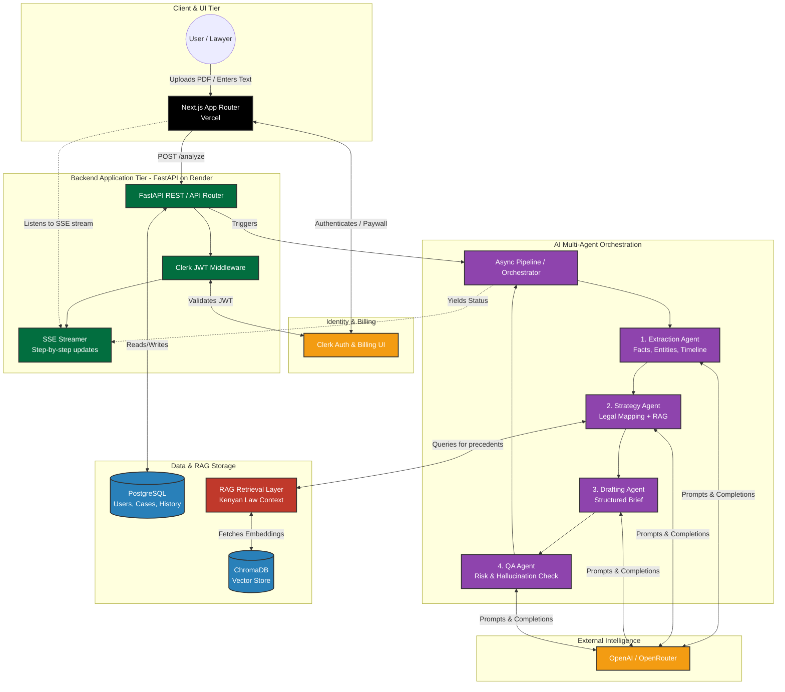

# Litigation Prep Assistant

[](https://python.org)
[](https://fastapi.tiangolo.com)
[](https://nextjs.org)
[](https://clerk.com)
[](https://www.trychroma.com)
[](https://openrouter.ai)
[](./backend/tests)
[](https://vercel.com)
[](https://render.com)
[](https://docs.astral.sh/uv/)

> **AI-powered litigation preparation for Kenyan law firms and paralegals.**

Litigation Prep Assistant is a multi-agent AI system that transforms raw case input -- text descriptions or uploaded PDFs -- into a structured legal brief. Four sequential agents (Extraction -> Strategy -> Drafting -> QA) process the case and stream their outputs step-by-step to the UI in real time via Server-Sent Events (SSE), giving lawyers and paralegals an interactive, auditable view of the AI's reasoning.

---

## Architecture



The backend orchestrates four agents sequentially. As each agent completes, the FastAPI `StreamingResponse` yields a `markdown_section` SSE event containing the rendered Markdown for that step. A final `complete` event carrying the `case_id` signals the end of the stream. The Next.js frontend consumes the stream and renders each section live -- no polling, no page reloads.

---

## Agent Roles

| Agent | Responsibility |
|-------|---------------|
| **Extraction Agent** | Pulls facts, named entities, and a chronological timeline from the raw case input using few-shot prompting and instructor-validated structured output |
| **Strategy Agent** | Retrieves relevant Kenyan statute excerpts via ChromaDB RAG, then maps facts to legal issues, arguments, and counterarguments |
| **Drafting Agent** | Produces a formal litigation brief following Kenyan High Court drafting conventions: Facts, Issues, Arguments, Counterarguments, Conclusion |
| **QA Agent** | Audits the draft for hallucinations, fabricated statute citations, logical gaps, and internal contradictions; assigns a risk level |

---

## Features

- **Deterministic pipeline** -- not a chatbot; a fixed Extraction -> Strategy -> Drafting -> QA sequence with a clear start and a typed output at every step
- **Structured output with automatic retry** -- instructor enforces Pydantic schemas on every JSON-mode LLM call; malformed responses are retried transparently without crashing the pipeline
- **Kenyan law RAG** -- ChromaDB with OpenAI `text-embedding-3-small` embeddings grounds strategy arguments in real statutes and precedents before reasoning begins
- **Few-shot extraction prompts** -- the extraction agent uses a versioned prompt registry with a domain-specific example to anchor output quality across model updates
- **Resilient orchestration** -- tenacity retries transient OpenAI errors with exponential backoff; each step has a configurable wall-clock timeout; RAG and QA failures degrade gracefully without discarding the brief
- **Real-time step viewer** -- SSE stream lets the UI render each agent section as it completes, giving the user live feedback on a process that would otherwise feel like a black box
- **Structured JSON logging** -- structlog emits per-request HTTP logs and per-LLM-call telemetry (latency, prompt tokens, completion tokens) in newline-delimited JSON in production
- **Offline evaluation harness** -- golden test cases for schema regression and an LLM-as-judge script that scores pipeline output on completeness, factual grounding, and actionability
- **Provider flexibility** -- `OPENAI_API_KEY` and `OPENROUTER_API_KEY` are supported; OpenAI takes priority when both are set, so switching providers requires only an env change
- **Auth & billing** -- Clerk handles sign-in, route protection, and subscription gating; JWKS validation runs server-side with a 5-minute cache
- **History** -- every analysis is persisted in the database with all five agent step results attached, retrievable from the dashboard
- **Monorepo** -- frontend, backend, infra, data, and docs live in one repo with clean domain boundaries

---

## Repository Layout

```
litigation-prep-assistant/
│
├── .github/workflows/
│   ├── backend-deploy.yml      # pytest + ruff + mypy + coverage gate
│   └── frontend-deploy.yml     # lint + Next.js build
│
├── frontend/                   # Next.js 16 App Router
│   └── src/
│       ├── app/
│       │   ├── page.tsx                    # / landing (redirects signed-in users)
│       │   ├── dashboard/
│       │   │   ├── page.tsx                # /dashboard overview
│       │   │   ├── new-scan/page.tsx       # /dashboard/new-scan — run a new analysis
│       │   │   └── scans/
│       │   │       ├── page.tsx            # /dashboard/scans — history list
│       │   │       └── [id]/page.tsx       # /dashboard/scans/[id] — analysis detail
│       │   ├── public/                     # /public/login, /public/pricing (unauthenticated)
│       │   └── subscriptions/page.tsx
│       ├── components/
│       │   ├── ui/                         # shadcn/ui primitives
│       │   ├── forms/case-input-form.tsx
│       │   ├── dashboard/                  # HistoryTable, FileUploader
│       │   ├── agents/                     # AgentStepViewer, ResultPanel
│       │   └── pipeline-markdown-panel.tsx # SSE stream renderer
│       ├── lib/
│       │   ├── api.ts                      # fetch + SSE client
│       │   └── agent-step-markdown.ts      # step -> Markdown serializer
│       └── types/case.ts
│
├── backend/
│   ├── src/
│   │   ├── agents/
│   │   │   ├── orchestrator.py             # async pipeline generator + SSE yield
│   │   │   ├── extraction.py               # few-shot + instructor JSON mode
│   │   │   ├── strategy.py                 # RAG-augmented legal analysis
│   │   │   ├── drafting.py                 # High Court brief in Markdown
│   │   │   ├── qa.py                       # hallucination + logic audit
│   │   │   ├── format_markdown.py          # agent output -> Markdown body
│   │   │   └── prompts/                    # versioned prompt modules
│   │   ├── api/
│   │   │   ├── dependencies.py             # Clerk JWT auth dependency
│   │   │   ├── routes_analyze.py           # POST /analyze -> SSE StreamingResponse
│   │   │   ├── routes_cases.py             # GET/DELETE /cases, GET /cases/{id}
│   │   │   └── routes_auth.py              # GET /me
│   │   ├── core/
│   │   │   ├── config.py                   # pydantic-settings: env -> typed config
│   │   │   ├── logging.py                  # structlog setup (JSON prod / console dev)
│   │   │   ├── openai_client.py            # shared AsyncOpenAI singleton (OpenAI / OpenRouter)
│   │   │   └── security.py                 # Clerk JWKS validation with TTL cache
│   │   ├── database/                       # SQLAlchemy async models + session
│   │   ├── rag/
│   │   │   ├── ingestion.py                # chunk + embed + write to ChromaDB
│   │   │   ├── retriever.py                # embed query + cosine similarity search
│   │   │   └── vector_store.py             # ChromaDB client + collection factory
│   │   ├── schemas/                        # AI output schemas, API request/response schemas
│   │   ├── serializers/                    # DB model -> API schema adapters
│   │   └── services/case_file_text.py      # PDF/TXT extraction from uploaded files
│   ├── evals/
│   │   ├── golden_cases.json               # 3 representative Kenyan cases with expected output constraints
│   │   ├── eval_extraction.py              # schema regression: runs agent, checks constraints
│   │   └── eval_llm_judge.py               # GPT-4o scores full pipeline on 3 rubric dimensions
│   └── tests/
│       ├── conftest.py                     # shared fixtures, mock agent outputs, SSE helpers
│       ├── test_analyze.py                 # SSE pipeline, input validation, error handling, DELETE
│       ├── test_history.py                 # case listing, user isolation, step detail
│       ├── test_rag.py                     # chunk_text, rag_retrieve, ingest_documents, integration
│       ├── test_schemas.py                 # AI Pydantic schema unit tests
│       ├── test_health.py
│       └── test_me.py
│
├── data/
│   ├── raw/                                # Kenyan statute source files (txt)
│   │   ├── contract_act_cap_23.txt
│   │   ├── employment_act_2007.txt
│   │   └── land_act_2012.txt
│   ├── test_cases/                         # Sample cases for manual testing
│   ├── processed/                          # Cleaned JSONL chunks (generated)
│   └── vector_db/                          # ChromaDB persistent index (git-ignored)
│
├── infra/
│   ├── docker-compose.yml                  # Postgres for local dev
│   ├── Dockerfile.backend                  # Container image for Render
│   └── init.sql
│
└── docs/
    ├── backend.md                          # Backend API reference and integration notes
    └── rag_integration_guide.md            # RAG pipeline design, ingestion, retrieval walkthrough
```

---

## Prerequisites

| Layer | Requirement |
|-------|-------------|
| Backend | Python 3.11+ and [uv](https://docs.astral.sh/uv/) |
| Frontend | Node.js 20+ LTS and npm |
| Local DB | Docker + Docker Compose (for Postgres; SQLite works with no setup) |
| Auth | A [Clerk](https://clerk.com) application (free tier sufficient) |
| LLM | An OpenAI API key, or an OpenRouter API key |

---

## Quick Start

### 1. Clone and configure environment variables

```bash
git clone https://github.com/<your-org>/litigation-prep-assistant.git
cd litigation-prep-assistant
```

Copy the example env files and fill in your keys:

```bash
cp backend/.env.example backend/.env
cp frontend/.env.example frontend/.env.local
```

**`backend/.env` (minimum required):**

```dotenv
# Use OpenAI directly, or replace with OPENROUTER_API_KEY for OpenRouter.
OPENAI_API_KEY=sk-...
# SQLite requires no extra setup; swap for Postgres when needed.
DATABASE_URL=sqlite+aiosqlite:///./litigation.db
```

**`frontend/.env.local` (minimum required):**

```dotenv
NEXT_PUBLIC_CLERK_PUBLISHABLE_KEY=pk_test_...
CLERK_SECRET_KEY=sk_test_...
NEXT_PUBLIC_API_URL=http://127.0.0.1:8000
```

### 2. Start the local database (optional -- skip if using SQLite)

```bash
cd infra
docker compose up -d
```

### 3. Run the API

```bash
cd backend
uv sync
uv run uvicorn src.main:app --reload --host 127.0.0.1 --port 8000
```

Interactive API docs: `http://127.0.0.1:8000/docs`

### 4. Run the frontend

```bash
cd frontend
npm install
npm run dev
```

App: `http://localhost:3000`

### 5. Build the RAG vector store (first time only)

```bash
cd backend
uv run python -m src.rag.ingestion
```

This reads all `.txt` and `.md` files from `data/raw/`, chunks them, embeds with `text-embedding-3-small`, and writes the index to `data/vector_db/`. Re-run whenever you add documents. See [docs/rag_integration_guide.md](./docs/rag_integration_guide.md) for a full walkthrough.

---

## Testing

### Backend

The backend test suite uses `pytest` with async support. All agents, the LLM, and the database are mocked -- tests run in under 20 seconds with zero API cost.

```bash
cd backend
uv run pytest             # run all 143 tests
uv run pytest -v          # verbose -- show each test name
uv run pytest -x          # stop on first failure
uv run pytest --tb=short  # concise failure tracebacks
```

**Test coverage by file:**

| File | What it covers |
|------|---------------|
| `tests/test_health.py` | `GET /health` liveness check |
| `tests/test_me.py` | `GET /api/v1/me` user identity endpoint |
| `tests/test_analyze.py` | `POST /api/v1/analyze` -- SSE pipeline, input validation, section ordering, error handling, per-agent DB persistence, `DELETE /api/v1/cases/{id}` |
| `tests/test_history.py` | `GET /api/v1/cases` + `GET /api/v1/cases/{id}` -- history listing, user isolation, step detail retrieval |
| `tests/test_rag.py` | `chunk_text` unit tests, `rag_retrieve` mocked retrieval, `ingest_documents` mocked embedding + Chroma, pipeline integration |
| `tests/test_schemas.py` | AI Pydantic schema unit tests -- model validation and serialization |

Run with coverage:

```bash
uv run pytest tests/ --cov=src --cov-report=term-missing
```

### Evaluations (live API calls, incurs cost)

Two offline eval scripts are provided in `backend/evals/`:

```bash
# Schema regression against 3 golden Kenyan cases
uv run python -m evals.eval_extraction

# LLM-as-judge scoring of the full pipeline (GPT-4o scores completeness, grounding, actionability)
uv run python -m evals.eval_llm_judge
uv run python -m evals.eval_llm_judge --threshold 3.5   # stricter pass threshold
```

---

## API Reference

| Method | Endpoint | Auth | Description |
|--------|----------|------|-------------|
| `GET` | `/health` | - | System health check |
| `GET` | `/api/v1/me` | Clerk JWT | Returns authenticated user profile |
| `POST` | `/api/v1/analyze` | Clerk JWT | Multipart form (`title`, `case_text`, optional `case_file`); returns SSE stream |
| `GET` | `/api/v1/cases` | Clerk JWT | Lists all past analyses for the user (optional `?q=` title filter) |
| `GET` | `/api/v1/cases/{id}` | Clerk JWT | Returns full case result and all agent steps |
| `DELETE` | `/api/v1/cases/{id}` | Clerk JWT | Deletes a case and its agent steps |

### SSE stream format (`POST /api/v1/analyze`)

Each line has the form `data: <json>\n\n`. Three event types are emitted:

```json
{ "type": "markdown_section", "section_id": "extraction",    "heading": "Fact extraction",    "markdown": "..." }
{ "type": "markdown_section", "section_id": "rag_retrieval", "heading": "Precedent retrieval", "markdown": "..." }
{ "type": "markdown_section", "section_id": "strategy",      "heading": "Legal strategy",      "markdown": "..." }
{ "type": "markdown_section", "section_id": "drafting",      "heading": "Draft brief",         "markdown": "..." }
{ "type": "markdown_section", "section_id": "qa",            "heading": "Quality review",      "markdown": "..." }
{ "type": "complete", "case_id": "<uuid>" }
{ "type": "error",    "detail": "<message>" }
```

---

## Deployment

| Service | Platform | Notes |
|---------|----------|-------|
| Frontend | [Vercel](https://vercel.com) | Set project root to `frontend/`; `vercel.json` preset included |
| Backend | [Render](https://render.com) | Use `infra/Dockerfile.backend`; set all env vars in Render dashboard |
| Database | Render Postgres / any managed PG | Point `DATABASE_URL` at your instance |
| Vector store | Packed into Docker image or mounted volume | See `data/vector_db/` -- add to `.dockerignore` carefully |

---

## Tech Stack

| Component | Tool |
|-----------|------|
| Frontend framework | Next.js 16 (App Router) |
| UI components | shadcn/ui + Tailwind CSS |
| Auth & billing | Clerk |
| Backend framework | FastAPI |
| Agent orchestration | Custom async pipeline with tenacity retry and step timeouts |
| LLM provider | OpenAI or OpenRouter (priority selection via env) |
| Structured output | Pydantic + instructor (JSON mode, automatic retry) |
| Embeddings + RAG | OpenAI `text-embedding-3-small` + ChromaDB (cosine similarity) |
| Logging | structlog (JSON in production, console in dev; LLM telemetry per call) |
| Relational database | PostgreSQL / SQLite (SQLAlchemy async) |
| Real-time streaming | Server-Sent Events (SSE) |
| Package manager (BE) | uv |
| CI/CD | GitHub Actions (pytest + ruff + mypy + coverage gate + Next.js build) |

---

## Design Decisions

| Decision | Rationale |
|----------|-----------|
| SSE over REST polling | FastAPI's `StreamingResponse` yields each step result as it completes, giving the UI a live feed without a long-polling loop or websocket management |
| Sequential async pipeline over multi-agent framework | Four agents with a fixed causal order do not need a routing framework; a plain async generator is easier to trace, test, and extend without framework lock-in |
| instructor (JSON mode) for structured output | Automatic Pydantic schema injection into the prompt and transparent retry on malformed JSON; removes manual `json.loads` and error handling from every agent |
| Few-shot extraction with versioned prompts | A single realistic Kenyan legal example in the extraction prompt significantly stabilises output structure; `PROMPT_VERSION` constants allow output quality to be correlated with prompt changes in logs |
| tenacity retry on OpenAI calls | Transient rate-limit and connection errors are retried with exponential backoff rather than surfaced to the user immediately, improving reliability without complexity |
| QA step treated as non-critical | A QA failure must not discard an otherwise complete brief; the pipeline emits a `complete` event and the QA section is simply absent, rather than aborting with an error |
| structlog for logging | Newline-delimited JSON in production is ingestible by any log aggregator without format negotiation; per-step LLM telemetry (latency, tokens) is emitted at `INFO` level |
| OpenAI / OpenRouter priority selection | The shared client factory checks `OPENAI_API_KEY` first, then `OPENROUTER_API_KEY`; no agent code changes are needed to switch providers |
| Clerk JWKS validation server-side | Bearer tokens are verified against Clerk's public JWKS with a 5-minute in-memory cache, avoiding a network round-trip on every request while still rotating keys within a reasonable window |

---

## Team Contributions

| Name | Role |
|------|------|
| **Rithwik** | FastAPI backend architecture, agent orchestration, AI integration |
| **John** | Next.js frontend (App Router), Clerk integration (auth + billing UI) |
| **Amit** | RAG pipeline, legal dataset ingestion + embeddings |
| **Damola** | Agent design (prompts + reasoning flow), QA agent logic |
| **Sodiq** | Deployment (Vercel + Render), database setup, logging + monitoring |

---

## Documentation

- [backend/README.md](./backend/README.md) -- Python layout, dependencies, and local run instructions
- [frontend/README.md](./frontend/README.md) -- Next.js scripts, routing, and environment variables
- [docs/rag_integration_guide.md](./docs/rag_integration_guide.md) -- RAG pipeline design, ingestion walkthrough, retrieval internals, and ChromaDB configuration
